# Настройка массовой рассылки WhatsApp через интеграцию с провайдером edna

Перед началом настройки массовой рассылки, следует убедиться, что интеграция с провайдером WhatsApp выполнена корректно.
Как это сделать можно прочитать в нашей [инструкции](../setup/whatsapp-integration/edna-integration.md).

После этого, можно переходить непосредственно к настройке массовой рассылки. Чтобы это сделать нужно перейти в подраздел **WhatsApp рассылки** в разделе **Массовые рассылки**

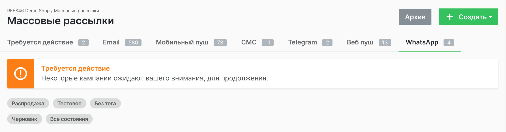

Обратите внимание: панель управления, расположенная в верхней части страницы, едина для всех типов рассылок. На панели есть вкладки, с помощью которых можно перейти к странице конкретного типа рассылок, кнопки **Архивировать** и **Создать**.

При нажатии на последнюю появится выпадающий список с типами рассылок. Выберите нужный и переходите в форму настройки рассылки.

## Форма настройки рассылки

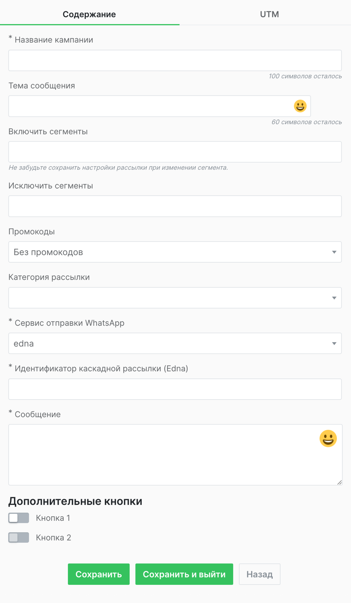

Одни поля формы работают с данными платформы, другие с шаблонами на стороне провайдера.

К последним относятся:

- **Тема сообщения**
- **Идентификатор каскадной рассылки (edna)**
- **Сообщение**
- **Переключатели кнопок**

Поля работающие с данными платформы:

- **Название кампании**
- **Включить сегменты**
- **Исключить сегменты**
- **Промокоды**
- **Категория рассылки**
- **Сервис отправки WhatsApp**

Порядок заполнения не имеет значения, но нужно понимать, что элементы в списках работают с разными сущностями.

Первый список - работа с шаблоном edna. Он проходит предварительную модерацию на стороне провайдера, и только потом в точности копируется в форму настройки рассылки.

Второй - работает со списками промокодов, сегментов, провайдеров WhatsApp (в нашем случае актуальна только edna), а также позволяет задать название кампании и категорию рассылки.

### Поля, заполняемые по шаблону edna

::: tip Обратите внимание

Форма настройки рассылки заполняется точно так же, как и шаблон на стороне edna. Различие в один символ, даже пробел, приведёт к ошибке.
Заполнение полей должно происходить строго в той же конфигурации, в которой был создан шаблон у провайдера. Например, если в шаблоне нет заголовка, то и в форме он не заполняется.
Должны совпадать тип и количество кнопок, если они предусмотрены в сообщении.

:::
К условно обязательным полям можно отнести: **Идентификатор каскадной рассылки (edna)** и **Сообщение**. В том смысле, что при заполнении этих двух полей (как на стороне провайдера, так и на стороне платформы) можно создать минимально рабочую рассылку (при условии, что поля взаимодействия с платформой также заполнены) без кнопок и заголовка.

#### Идентификатор каскадной рассылки (edna)

Пользователь получает идентификатор на стороне провайдера. Без его указания, невозможно отправить рассылку. Таким образом, поле обязательно для заполнения.

#### Сообщение

В это поле должно вноситься содержание рассылки. Текст в форме должен полностью, до последнего символа, совпадать с прошедшим модерацию шаблоном на стороне edna. Появилась поддержка emoji, добавлен `emoji picker`.

::: tip Обратите внимание

**Сообщение** поддерживает liquid-переменные. Но для того, чтобы они работали, шаблон должен изначально создаваться с учётом их возможного размещения.

Места вставки переменной в поле **Сообщение** и в шаблоне должны полностью совпадать.

:::
#### Изображение

С помощью данной формы, можно добавить изображение в тело сообщения.

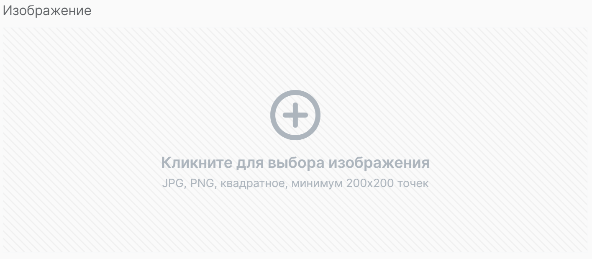

Требования к изображению:

1. Формат JPG или PNG
2. Квадратное
3. Минимальный размер - 200х200 точек

#### Тема сообщения

Заголовок рассылки заполняется только в том случае, если он есть и в прошедшем модерацию шаблоне. Он не поддерживает liquid-переменные, но пользователь имеет возможность добавить туда emoji с помощью инструмента `emoji picker`.

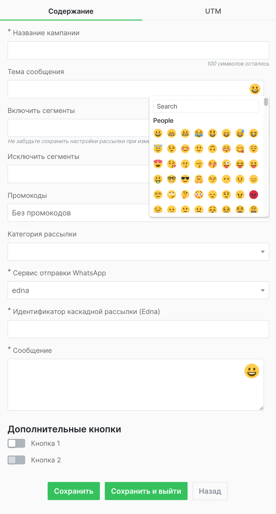

#### Переключатели кнопок

Переключатели добавляют к сообщению кнопки. Они должны полностью соответствовать зарегистрированному шаблону: текст, тип, количество. При изменении положения переключателя на активный, появляются поля, которые позволяют задавать параметры.

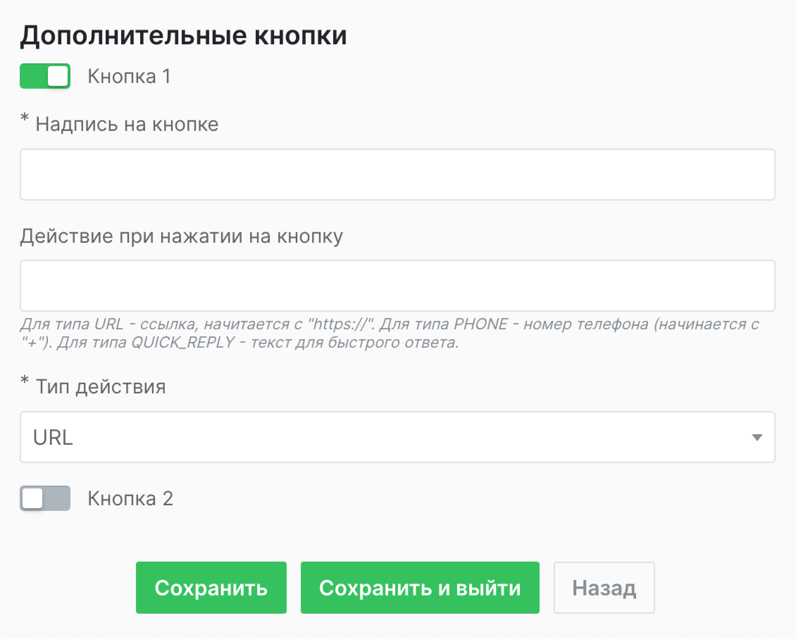

Всего доступно три типа:

- _URL_
- _PHONE_
- _QUICK REPLY_

Тип выбирается с помощью выпадающего списка в последнем поле. От выбора пользователя зависит действие, которое нужно указать. Для _URL_ в поле **Действие при нажатии на кнопку** указывается ссылка, для _PHONE_ номер телефона, который должен начинаться с **+**.
Если выбрана опция _QUICK REPLY_, то нужно задать текст, который попадёт в переменную на стороне edna. Предполагается, что с её помощью можно будет настроить чат-бот.

::: tip Обратите внимание

Настройка чат-бота - это задача, которая решается исключительно силами пользователя.

:::

### Поля, использующие инструменты платформы

Чтобы полноценно раскрыть возможности интеграции, нужно задействовать ряд инструментов платформы. Для их подключения к рассылке нужно заполнить некоторые из перечисленных ниже полей. Другие поля нужны для подключения и управления рассылкой.

#### Название кампании

Заполнение этого поля позволяет не только задать идентификатор рассылки, но и создаёт элемент управления, который доступен в общем списке рассылок. Название - это активный элемент, при нажатии на который открывается окно дополнительных настроек и тестирования рассылки.

#### Включить сегменты

Использование сегментов позволяет выбирать адресатов для проведения целевой рассылки. Для выбора сразу нескольких сегментов нужно пользоваться кнопкой **Сохранить** после добавления каждого нового сегмента. Для выбора всех доступных сегментов, нужно выбрать опцию **Все** из выпадающего списка.

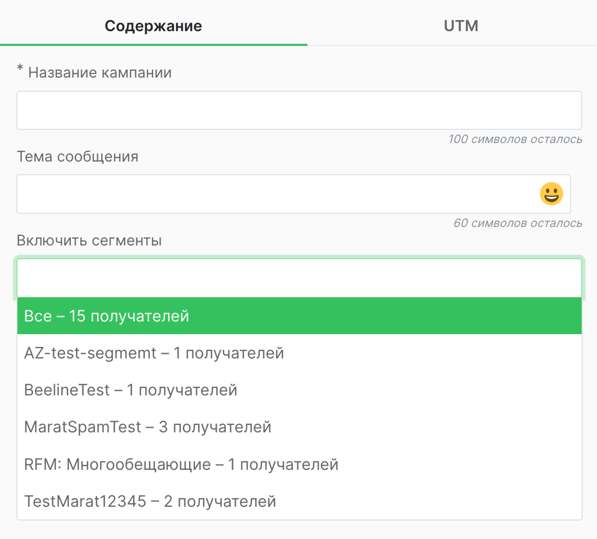

####  Исключить сегменты

Возможность включить в рассылку все сегменты значительно упрощает настройку. Исключение сегментов позволяет сузить область рассылки в соответствии с желаемыми параметрами.

#### Промокоды

Поле заполняется при помощи выбора из списка заранее заготовленных промокодов. Использование в рассылке осуществляется путём добавления liquid-переменных в тело сообщения.

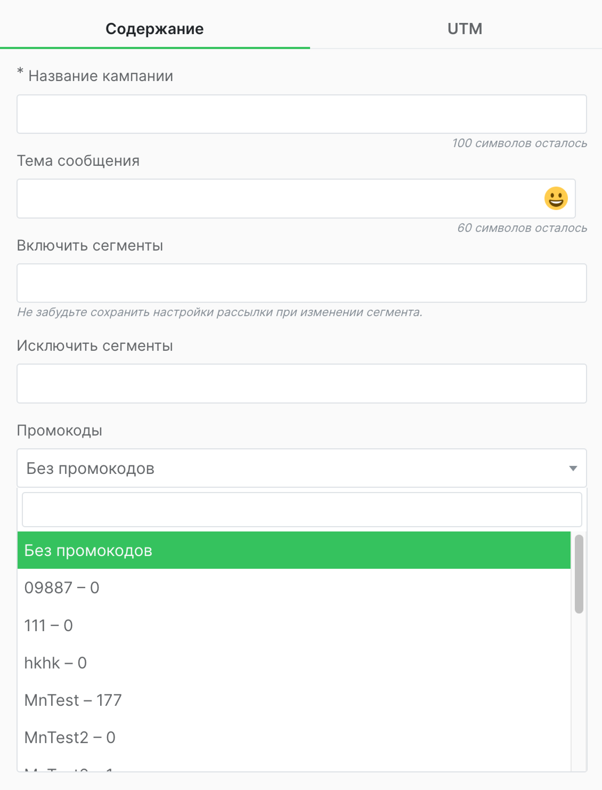

#### Категория рассылки

Выбор из двух опций - **Промо** и **Информационная рассылка**.

#### Сервис отправки WhatsApp

Выбор из списка настроенных провайдеров.

###  Панель управления в форме настройки

В нижней части формы расположены три кнопки:

- **Сохранить**
- **Сохранить и выйти**
- **Назад**

Последняя возвращает пользователя на главную страницу. В результате все введённые в форму настроек данные исчезнут. Чтобы сохранить состояние формы, нужно воспользоваться кнопкой **Сохранить**.

Возникает вопрос: зачем она нужна, когда есть кнопка **Сохранить и выйти**. Дело в том, что, при заполнении полей **Включить сегменты** и **Исключить сегменты**, выбор из списка сегментов по умолчанию переключает текуще значение в форме. Кнопка **Сохранить** позволяет зафиксировать выбор сегмента и добавить следующий.

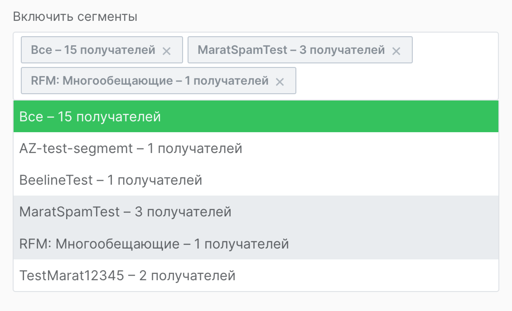

### Вкладка UTM

Поля в данной форме нужны для указания основных UTM-метрик для систем аналитики.

- **UTM source**
- **UTM medium**
- **UTM campaign**
- **UTM campaign term**
- **UTM campaign content**

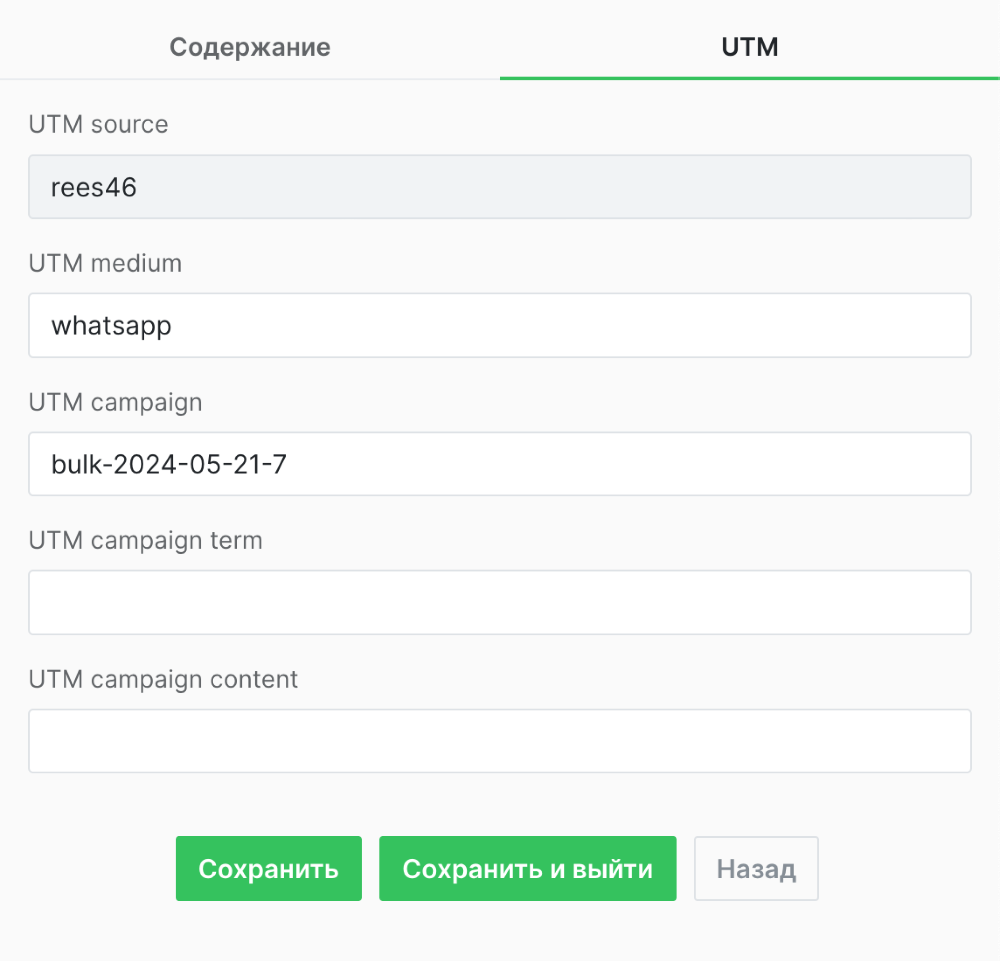

Соответственно, источник трафика, канал, название кампании, ключевое слово и дополнительный параметр, который позволит отличить контент от другого, похожего.

## Настройка отправки и тестирование рассылки

После первичной настройки, пользователь попадёт на страницу со списком рассылок. Чтобы протестировать, отредактировать или настроить режим отправки достаточно нажать на название кампании.

После этого пользователь попадает на страницу, где можно настроить доставку, А/Б тестирование или проверить корректность работы рассылки.

### Проверка рассылки

Форма справа поможет проверить корректность настройки кампании. Она состоит из поля для ввода номера телефона и кнопки **Отправить сообщение**. Если сообщение пришло на указанный тестовый номер - всё в порядке.

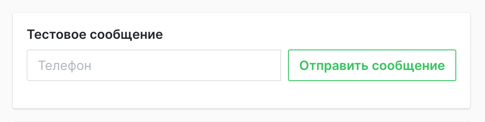

::: tip Обратите внимание

Если сообщение не пришло, то возможности быстро узнать причину на стороне платформы нет. В первую очередь, нужно посмотреть сообщение об ошибке в аккаунте edna.
Вероятнее всего, ошибка будет указывать на несовпадение шаблона, который прошёл модерацию на стороне провайдера, и отправляемого сообщения.
В большинстве случаев проблема действительно в этом. Сверьте шаблон с тем сообщением, которое собираетесь отправить. Если всё в порядке, но ошибка всё равно указывает на шаблон, следует обратиться к технической поддержке провайдера.
Если на их стороне всё будет в порядке, следует обращаться в поддержку платформы.

:::

### Настройка отправки

Слева находится таблица с несколькими переключателями, которые позволяют устанавливать параметры доставки.

- **Отложенная отправка**
- **По часовому поясу получателя**
- **Смарт доставка**
- **Режим дозированной отправки**

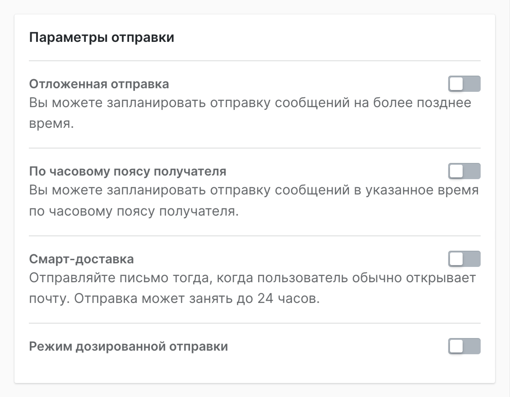

Первые три переключателя отвечают за отправку в более позднее время. Первый позволяет запланировать рассылку по часовому поясу отправителя, второй - по часовому поясу получателя. Третий - осуществляет доставку примерно в то время, когда адресат открывает почту. Нужно учитывать, что такая отправка может занять до 24 часов.

**Режим дозированной отправки** устанавливает лимит на количество отправлений в течение одного часа.

### А/Б тест

Запуск режима А/Б тестирования осуществляется через кнопку на панели управления в верхней части страницы.

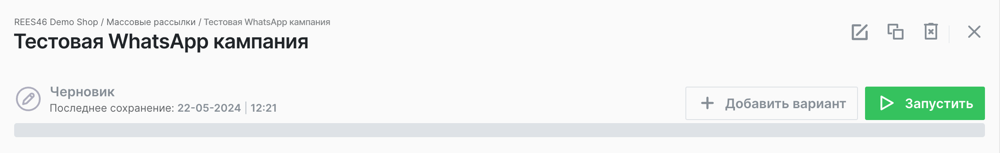

После запуска интерфейс с изображением кампании будет разделён на две части: кампанию А и кампанию Б.

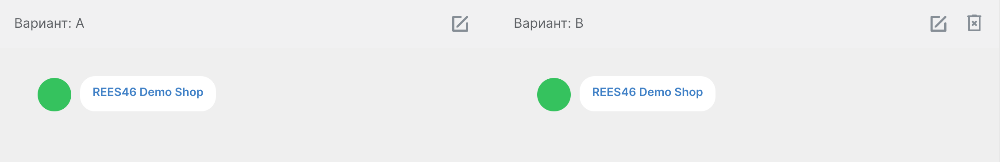

В верхней части интерфейса кампаний будет расположена небольшая панель управления, которая состоит из двух кнопок: _редактировать_ и _удалить_.

При нажатии на кнопку редактировать, откроется форма настройки рассылки.

::: tip Обратите внимание

Так как модерация шаблона осуществляется на стороне edna, включая заголовок и кнопки, отредактировать их, как и тело сообщения, нельзя.
Однако, поскольку промокоды добавляются с помощью liquid-переменных, можно будет протестировать разные списки на одной и той же аудитории.
Другой вариант - проверять одни и те же промокоды в разных сегментах.

:::

Настройка А/Б теста осуществляется с помощью элемента ползунок, который появляется в таблице настройки отправки после того, как была нажата кнопка **Режим А/Б тестирования**.

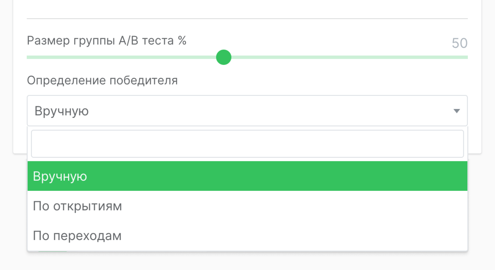

С помощью элемента _ползунок_ можно будет определить процент получателей, которому будет отправлена рассылка А. Остальные получат рассылку Б.
Победителя можно определить как вручную, так и автоматически: подсчётом открытий или переходов.

