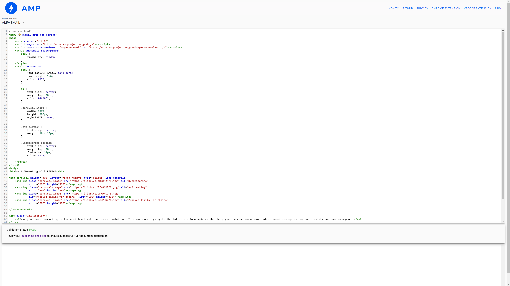
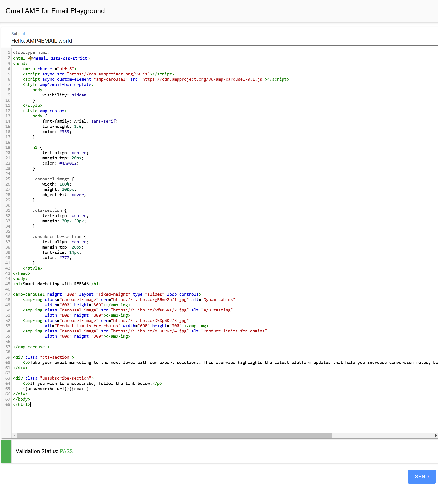
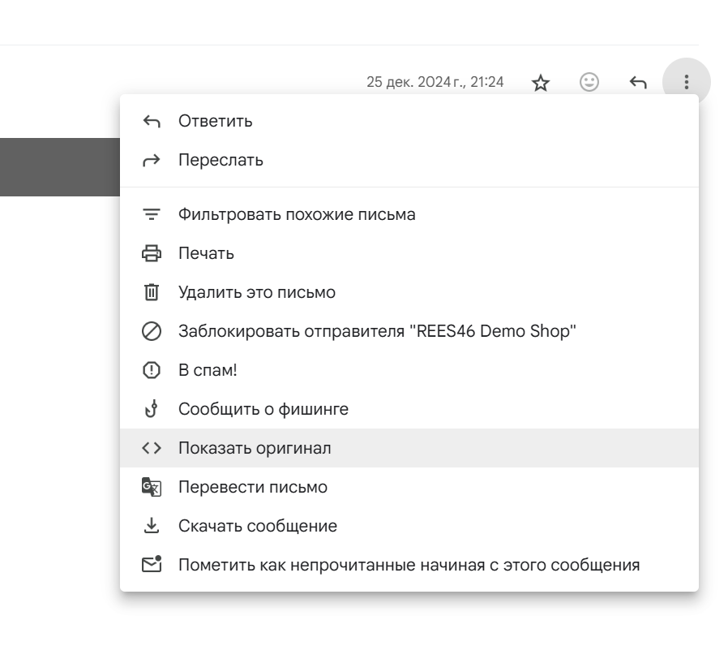
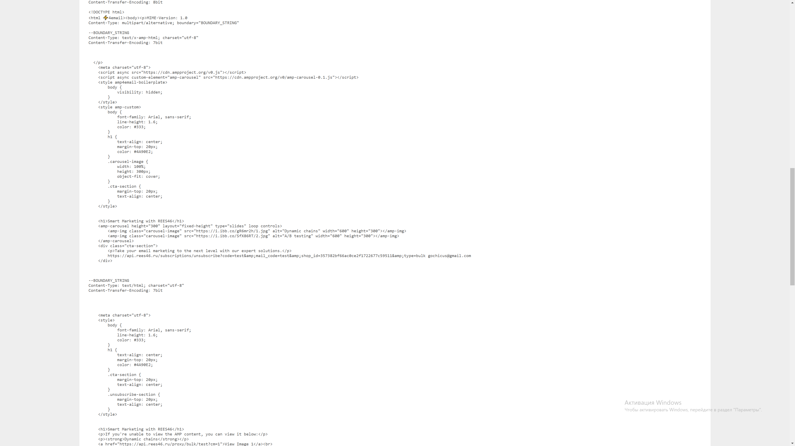

# Как зарегистрироваться в качестве отправителя писем с amp-контентом у провайдера Gmail

Для регистрации требуется соблюдение ряда условий:

* Соответствие тестового письма спецификациям AMP for email.
* У вас настроены DKIM и SPF записи.
* Ваше тестовое письмо содержит `HTML/Plain Text` версию для тех, у кого по каким-то причинам не работает поддержка динамического контента.
* Вы соответствуете требованиям, которые сервис предъявляет отправителям почтовых рассылок.

При подготовке к подаче заявления желательно свериться с документацией Gmail и убедиться, что вы [соответствуете требованиями](https://developers.google.com/gmail/ampemail/register).

Одно из требований для отправки вашего шаблона письма: отсутствие слова **«Тест»**. Не рекомендуется также использовать его производные и схожие по смысле слова  и выражения.

В требованиях чётко указана необходимость отправки на проверку реального прототипа того, что будет уходить в рассылке вашим клиентам. Тестовые шаблоны отклоняются без рассмотрения.

## Валидность шаблона

Для валидации вашего шаблона нужно использовать как[ нативный AMP-валидатор](https://validator.ampproject.org/#htmlFormat=AMP4EMAIL), так и [песочницу Google](https://amp.gmail.dev/playground/).

Ваша задача – добиться идеального идеальной валидации, в строгом режиме, без предупреждений.

Приложенный в качестве примера шаблон успешно прошёл обе проверки:





Учитывайте такой момент: одно из обязательных требований – содержание  `HTML/Plain Text` компонента, который будет дублировать динамический для тех, у кого последний не будет работать.

При этом, валидировать нужно всё письмо, а не компоненты по отдельности.

Из-за этого возможно возникновение следующей ситуации. Например, вы хотите использовать в своём шаблоне amp-карусель.

Для этого вам понадобится использовать теги `<amp-image>`. При этом, тег `<image>` строго запрещён в AMP, и если захотите использовать его в дублирующем компоненте, ваш шаблон просто не пройдёт валидацию уже на уровне песочницы.

Для регистрации рекомендуем подбирать упрощённый шаблон, который пройдёт валидацию даже с учётом наличия дублирующего компонента.

<details>

<summary>Пример шаблона, прошедшего регистрацию</summary>


```
<!doctype html>
<html ⚡4email data-css-strict>
<head>
    <meta charset="utf-8">
    <script async src="https://cdn.ampproject.org/v0.js"></script>
    <script async custom-element="amp-carousel" src="https://cdn.ampproject.org/v0/amp-carousel-0.1.js"></script>
    <style amp4email-boilerplate>
        body {
            visibility: hidden
        }
    </style>
    <style amp-custom>
        body {
            font-family: Arial, sans-serif;
            line-height: 1.6;
            color: #333;
        }

        h1 {
            text-align: center;
            margin-top: 20px;
            color: #4A90E2;
        }

        .carousel-image {
            width: 100%;
            height: 300px;
            object-fit: cover;
        }

        .cta-section {
            text-align: center;
            margin: 30px 20px;
        }

        .unsubscribe-section {
            text-align: center;
            margin-top: 20px;
            font-size: 14px;
            color: #777;
        }
    </style>
</head>
<body>
<h1>Smart Marketing with REES46</h1>

<amp-carousel height="300" layout="fixed-height" type="slides" loop controls>
    <amp-img class="carousel-image" src="https://i.ibb.co/gR6mr2h/1.jpg" alt="Dynamicahins"
             width="600" height="300"></amp-img>
    <amp-img class="carousel-image" src="https://i.ibb.co/SfX86RT/2.jpg" alt="A/B testing"
             width="600" height="300"></amp-img>
    <amp-img class="carousel-image" src="https://i.ibb.co/D5XpWKJ/3.jpg"
             alt="Product limits for chains" width="600" height="300"></amp-img>
    <amp-img class="carousel-image" src="https://i.ibb.co/xJ9PPNc/4.jpg" alt="Product limits for chains"
             width="600" height="300"></amp-img>

</amp-carousel>

<div class="cta-section">
    <p>Take your email marketing to the next level with our expert solutions. This overview highlights the latest platform updates that help you increase conversion rates, boost average sales, and simplify audience management.</p>
</div>

<div class="unsubscribe-section">
    <p>If you wish to unsubscribe, follow the link below:</p>
    {{unsubscribe_url}}{{email}}
</div>
</body>
</html>
```
</details>

## Тестовая отправка

После того как вы сделаете подходящий валидный шаблон, попробуйте сделать тестовую отправку на свою же почту.

::: tip Убедитесь, что у вас включено отображение amp-контенте

Включение AMP в настройках:

* В веб-версии Gmail:

    * Откройте Gmail в браузере.

    * Нажмите на значок шестеренки в правом верхнем углу.

    * Выберите "Настройки".

    * Перейдите на вкладку "Общие".

    * Убедитесь, что включена опция "Динамическая почта" (это и есть AMP-контент).

    * Нажмите "Сохранить изменения" внизу страницы.

* В мобильном приложении:

    * AMP-контент должен отображаться автоматически, если он поддерживается письмом. Убедитесь, что у вас включены автоматические обновления приложения.

:::

Посмотрите на полученное письмо. Если у вас включён amp-контент, вы сразу же поймёте всё ли у вас правильно работает.

Если всё в порядке, то пришло время изучить структуру полученного письма. Для этого вам нужно извлечь его исходный код.





Теперь нужно поместить скопированную структуру в валидаторы.

И вот на этом этапе могут возникнуть проблемы. Дело в том, что при дешифровке сообщения может немного измениться структура сообщения.

Для человеческого взгляда это будет одно и то же письмо, а вот  HTML может слегка поменяться. И вот эта, уже изменённая, разметка может не пройти валидацию.

Когда вы пришлёте свой шаблон на верификацию, специалисты будут работать  с разметкой полученного ими письма, а не тем, что было валидировано вами локально перед отправкой.

На этом этапе главной задачей станет изменение структуры вашего письма таким образом, чтобы валидацию проходила структура сообщения после получения и дешифровки.

Для обычной рассылки прикладывать такие усилия не нужно, но на этапе верификации вашего шаблона действуют строгие правила. Поэтому хорошим решением будет максимально упростить структуру письма. Свести риски некорректной дешифровки к минимуму.

После того как вам удастся получить валидный шаблон (до и после отправки) можно переходить к заполнению формы и собственно отправки письма на проверку.

## Отправка шаблона на проверку

Вы должны отправить валидный шаблон на адрес ampforemail.whitelisting@gmail.com.

1. Не отправляйте его в рассылке с другими письмами, но создание специальной рассылки с вашим шаблоном на этот адрес вполне допустимо. Именно так был зарегистрирован демошоп REES46.
2. Письмо должно быть похоже на реальную рассылку, какую вы бы отправили клиентам.
3. Избегайте слова **тест** и сходных по смыслу. Их не должно быть ни в заголовке, ни в теле письма.
4. Динамический контент может отображаться не у всех пользователей, поэтому его содержание должно быть продублировано обычной HTML-разметкой.
5. Не имеет значения отправите ли вы письмо до или после заполнения регистрационной формы.

## Заполнение формы и регистрация

После того как вы убедились, что ваша форма точно проходит валидацию, приходит время заполнять [форму регистрации](https://docs.google.com/forms/d/e/1FAIpQLSdso95e7UDLk_R-bnpzsAmuUMDQEMUgTErcfGGItBDkghHU2A/viewform).

Форма заполняется сразу для трёх почтовых сервисов: Mail.ru, Gmail, Yahoo. В данном случае мы рассматриваем только Gmail, но по опыту регистрации можем утверждать, что блоки с вопросами сервисов, которые вас не интересуют, можно смело пропускать - форма всё равно будет валидной.

Список общих вопросов:

| **Поле формы**                                                                                 | **Описание**                                                                           |
|------------------------------------------------------------------------------------------------|----------------------------------------------------------------------------------------|
| Электронная почта                                                                              | Адрес электронной почты, связанный с аккаунтом.                                        |
| Name                                                                                           | Имя контактного лица, заполняющего форму.                                              |
| Company name                                                                                   | Название компании.                                                                     |
| Company website                                                                                | Веб-сайт компании.                                                                     |
| Company's privacy policy URL                                                                   | Ссылка на политику конфиденциальности компании                                         |
| Company's country of origin                                                                    | Страна происхождения компании.                                                         |
| Email address your AMP emails will be sent from                                                | Адрес электронной почты, с которого будут отправляться AMP-письма (только один адрес). |
| What use case(s) do you plan to deliver using AMP for Email?                                   | Описание целей использования AMP для электронной почты.                                |
| Third-party ESP(s) used to send emails through, if any                                         | Указание сторонних сервисов для отправки писем, если они используются.                 |
| Согласие на использование названия бренда для продвижения AMP for Email и участие в кейс-стади | Согласие на использование бренда в промо-материалах и участие в исследованиях.         |

В форме Gmail есть обязательное поле, в котором нужно указать зарегистрированы ли ваша компания для в качестве отправителя рассылок с amp контентом.

Другой вопрос касается отправки письма на адрес **ampforemail.whitelisting@gmail.com** для проверки. Можно послать письмо с вашим шаблоном перед заполнением формы, можно после.

Обязательно отметьте опцию получения копии на ваш личный почтовый адрес.

### Время проверки и модерация

Стандартное время проверки шаблона составляет пять рабочих дней. Письма проверяются модераторами и в случае отказа, вам придёт ответ с разъяснениями причин.

Однако, ваше письмо может и не дойти, уточнить и задать вопрос не получится. Формат проверки не подразумевает двухсторонней коммуникации.

В этом случае, по истечение установленного времени, повторно заполните форму и отправьте письмо на проверку. 