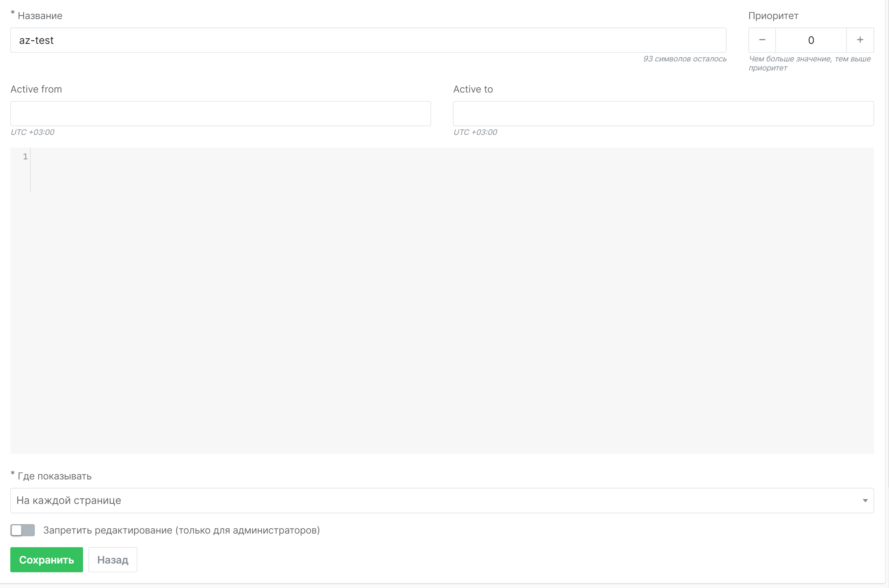

# Вставляемые скрипты

В этой части платформы представлен интерфейс, который позволяет создавать и управлять размещением скриптов, встраиваемых на страницы.

Списки существующих скриптов можно просматривать, переключаясь между вкладками:

1. **Все скрипты**
2. **Используемые**
3. **В разработке**

Информация о скриптах отображается в четырёх колонках:

1. **ID** — идентификатор скрипта в системе
2. **Приоритет** — порядок выполнения скриптов на странице магазина при наличии нескольких
3. **Название** — заданное пользователем имя скрипта
4. **Статус** — текущее состояние скрипта: **Включён**, **Отключён**, **Режим разработки**

## Создание скрипта

В правом верхнем углу экрана находится кнопка **Создать**. После её нажатия откроется форма, в которую нужно ввести название скрипта (до 100 символов).

После ввода названия и нажатия кнопки **Сохранить**, откроется интерфейс редактирования скрипта. В нём можно настроить параметры активности и отображения.

### Поля интерфейса

1. **Название** — автоматически заполняемое поле, где можно изменить название скрипта
2. **Приоритет** — порядок выполнения скрипта, важен для страниц с несколькими скриптами
3. **Active from** — дата начала активности скрипта
4. **Active to** — дата окончания активности скрипта
5. **Поле для размещения кода**
6. **Где показывать** — выбор варианта отображения:
    - **На каждой странице**
    - **На определённых страницах**

::: tip Период активности и статус

Скрипт не инициируется, если текущая дата меньше даты начала активности или больше даты окончания. При этом статус активности не изменяется автоматически, учтите это при настройке.

:::

При выборе опции **На определённых страницах** появляются два дополнительных поля:

1. **Как проверить URL**
2. **Значение для проверки**

Во втором поле указывается URL, который будет сравниваться с текущей страницей пользователя. Для проверки доступны следующие опции:

1. **Если URL равен**
2. **Если URL начинается с**
3. **Если URL содержит строку**
