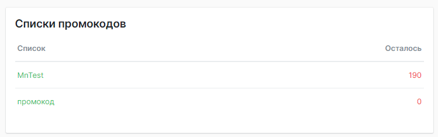
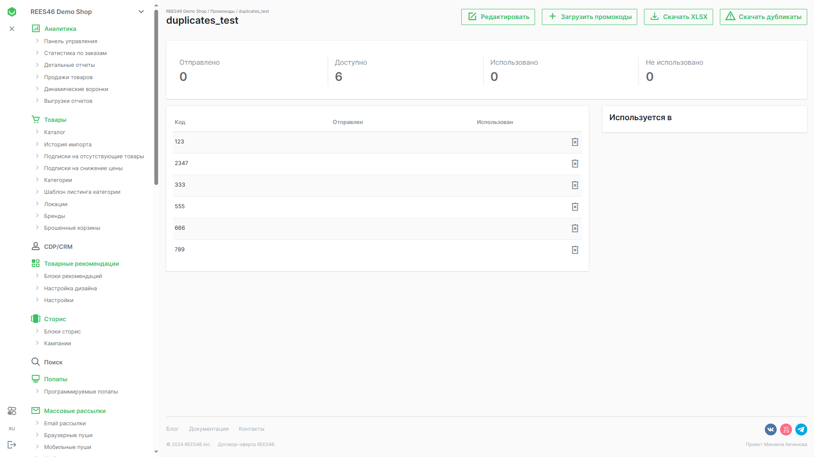

---
meta:
- name: description
  content: Раздел управления промокодами
---
# Промокоды

Выводятся названия списков промокодов и количество доступных промокодов для использования в рассылках.

При нажатии на название, пользователь переходит в окно управление списком промокодов.

## Управление промокодами

Панель управления промокодами находится в правой верхней части страницы.

По умолчанию видимы три кнопки:

- **Редактировать**
- **Загрузить промокоды**
- **Скачать XLSX**

::: tip Кнопка "Скачать дубликаты"
При загрузке промокодов, которые уже присутствуют в списке, на панели управления в верхней части появляется дополнительная кнопка. При нажатии пользователь переходит к списку промокодов, которые являются дубликатами уже имеющихся.
:::

Кнопка **Редактировать** позволяет задать название списка промокодов. Также при редактировании можно указать порядок использования промокодов.

При выборе значения **FIFO** первыми из списка будут использоваться промокоды, которые были добавлены раньше. При **LIFO**, первыми будут использоваться промокоды добавленные позже.

Управление загрузкой промокодов происходит с помощью кнопки **Загрузить промокоды**. При нажатии пользователь попадает в форму загрузки файлов объёмом до 32 мегабайт.

Загрузка списка промокодов происходит после нажатия на кнопку **Скачать XLSX**.
