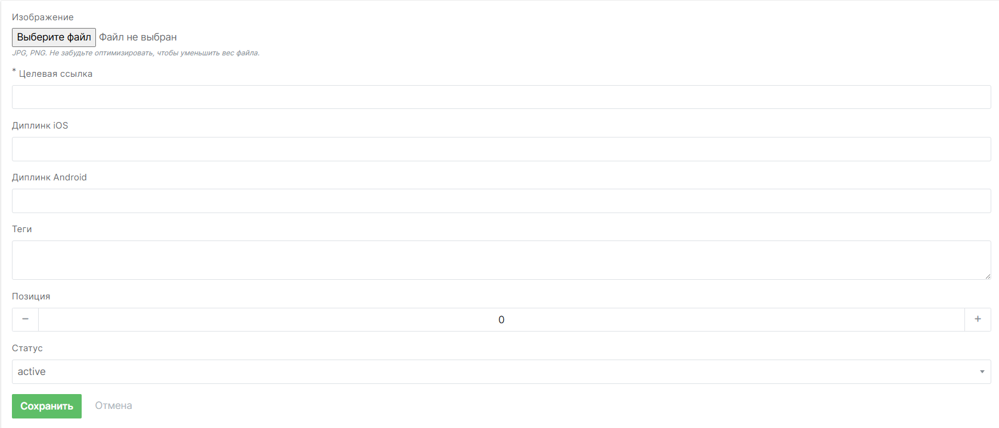

# Баннеры и слайдеры

Управление баннерами и слайдерами для рассылок находится в разделе **"Общий контент"**, подраздел **"Баннеры и слайдеры"**. Здесь можно создавать и настраивать баннеры без ограничений по сроку действия.

Инструмент позволяет маркетологам управлять полным стеком баннеров из одной панели.

## Настройка баннеров и слайдеров

При переходе в подраздел отображается список групп баннеров. Группа — это набор баннеров, объединённых под одним уникальным кодом (стеком). Каждый баннер в группе может отличаться по изображению, ссылке и другим параметрам.



### Как создать баннер

1. Загрузите изображение в формате JPG или PNG. Рекомендуется предварительно оптимизировать файл для уменьшения размера
2. Укажите целевую ссылку — пользователь будет перенаправлен по ней при клике на баннер
3. Добавьте диплинк для iOS
4. Добавьте диплинк для Android
5. Укажите теги — они используются для фильтрации баннеров на стороне клиента
6. Задайте позицию баннера в списке
7. Выберите статус: **активен** или **неактивен**

::: tip Позиция

По умолчанию баннеры возвращаются в порядке создания. Позиция позволяет вручную задать порядок. Например, баннер с позицией `3` будет третьим в ответе API.

:::

## Работа с баннерами через API

При создании группы баннеров задаётся **уникальный код**, по которому стек можно получить через API:

::: code-group

```json [cURL]

curl https://api.rees46.ru/slider?shop_id=...&code=...&did=...&email=...&phone=...&external_id=...&tags=...


```
```json [Пример ответа API]
{
  "status": "success",
  "payload": {
    "properties": {
      "code": "homepage_mobile",
      "width": 1000,
      "height": 160
    },
    "banners": [
      {
        "image_url": "...",
        "url": "...",
        "deeplink_ios": "...",
        "deeplink_android": "...",
        "content_type": "...",
        "content": "...",
        "html": "..."
      },
      ...
    ]
  }
}

```
```javascript [JS SDK]
/* Вы можете использовать стандартную реализацию, добавив следующий блок на свою страницу */

<div class="rees46-slider" data-slider-code="SLIDER_CODE"></div>

/*

Самостоятельная отрисовка (получение "сырых" данных). Следующий пример предполагает, что SDK уже импортирован и инициализирован.

Убедитесь, что указан корректный код слайдера. Это обязательное требование. В ответ возвращается JSON с данными. Используйте этот режим, если вы хотите реализовать собственную отрисовку слайдера.

*/

r46('slider', {code: "SLIDER_CODE"}, r => console.log(r))

/*

Кастомная отрисовка в указанный блок с возможностью изменения настроек.

В этом случае обязательны два параметра: code и block.

block — ID элемента, в который будет встроен слайдер.

config — необязательный параметр для конфигурации слайдера.

*/

r46('slider', {code: 'demoshop_main', block: 'rees46-slider', config: {dotBgColor: 'red', dotActiveBgColor: 'green', dotHoverBgColor: 'yellow'}})
```

```markdown [HTTP запрос и ответ API]

### HTTP Запрос

`GET https://<%= config[:api_endpoint] %>/slider`

### Параметры запроса

| Параметр    | Обязательный | Описание                                                  |
|-------------|--------------|-----------------------------------------------------------|
| did         | нет          | Идентификатор устройства. Получается из метода `init` SDK |
| email       | нет          | Email пользователя                                        |
| phone       | нет          | Телефон пользователя                                      |
| external_id | нет          | ID пользователя из вашей базы данных                      |
| shop_id     | да           | Ваш API ключ                                              |
| code        | да           | Уникальный код слайдера                                   |
| tags        | нет          | Теги для фильтрации баннеров (список тегов через запятую) |


### Ответ API

Структура объекта

| Название   | Тип      | Описание                      |
|:-----------|:---------|-------------------------------|
| properties | object   | Объект со свойствами слайдера |
| slides     | banner[] | Список баннеров               |


Структура объекта `properties`:

| Название | Тип     | Описание                   |
|:---------|:--------|----------------------------|
| code     | string  | Уникальный код слайдера    |
| width    | integer | Ширина баннера в пикселях  |
| height   | integer | Высота баннера в пикселях  |


Содержимое `banner`:

| Название         | Тип    | Описание                                    |
|:-----------------|:-------|---------------------------------------------|
| image_url        | string | URL изображения                             |
| url              | string | URL назначения                              |
| deeplink_ios     | string | Deeplink для iOS                            |
| deeplink_android | string | Deeplink для Android                        |
| content_type     | string | Тип контента (зарезервированное поле)       |
| content          | text   | Содержимое баннера (зарезервированное поле) |
| html             | html   | Содержимое баннера (HTML)                   |

```

:::

Также важно указать **теги**: с их помощью можно выбрать конкретные баннеры внутри стека.

Иными словами:

- **Уникальный код** определяет группу (стек) баннеров.
- **Теги** определяют конкретные баннеры внутри этой группы.

## Баннеры для рассылок

Баннеры можно использовать в любых типах рассылок: массовых и триггерных. Чтобы отобразить нужный баннер, достаточно указать тег в шаблоне.

Главное преимущество — **управление содержимым без правки шаблона**. Если в шаблоне уже указан тег, вы можете в любой момент заменить изображение, ссылку или диплинк — и новый баннер автоматически подставится в рассылку. Это снижает риск ошибок и упрощает редактирование контента.


