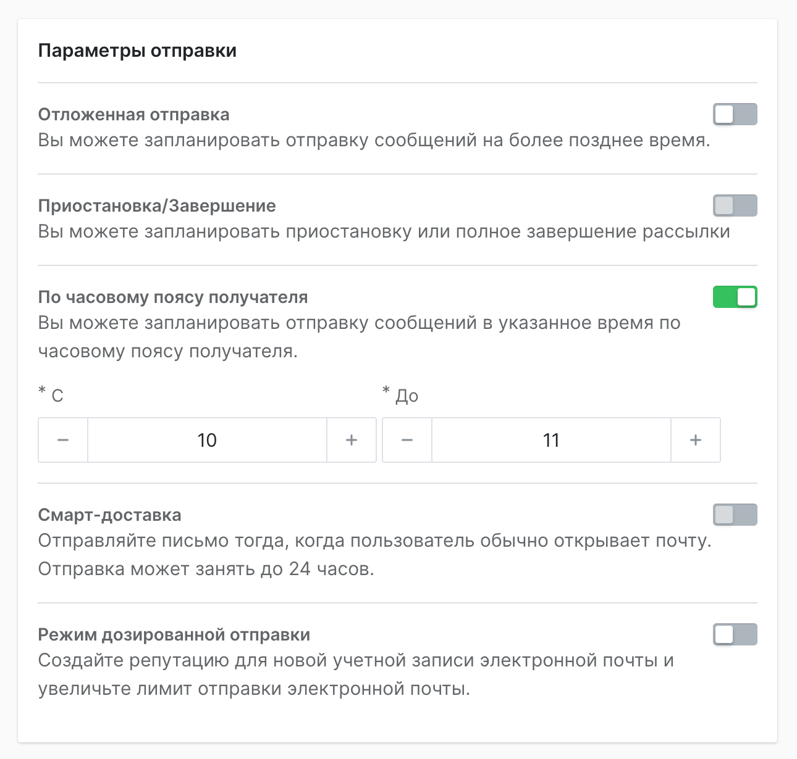

# Отправка рассылки по часовому поясу клиента

Сервис позволяет выбрать окно в течение дня, в которое письмо должно быть доставлено каждому получателю с учетом его часового пояса.

Например, исходные данные:

1. Часовой пояс магазина: MSK
2. Время запуска рассылки: 10:00
3. Окно доставки: с 11 до 13 часов

Письма будут распределены так, что в каждом часовом поясе получателям письмо придет именно в этом окне.

Но есть ограничения:

:::info 
Рассылка не переносится на следующий день.
:::

1. Если время в далёком часовом поясе уже прошло на момент запуска, рассылка будет доставлена как можно быстрее. Например, получатели из Владивостока получат рассылку не с 11 до 13 (это время уже прошло), а с 17 до 18 часов (с 10 до 11 по часовому поясу магазина – время запуска рассылки).
2. Если вы запустите рассылку в 23:00, то часовые пояса будут проигнорированы и рассылка уйдет как можно быстрее.

