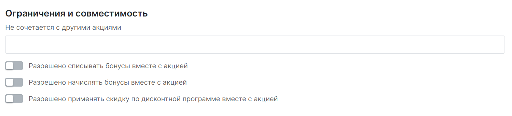
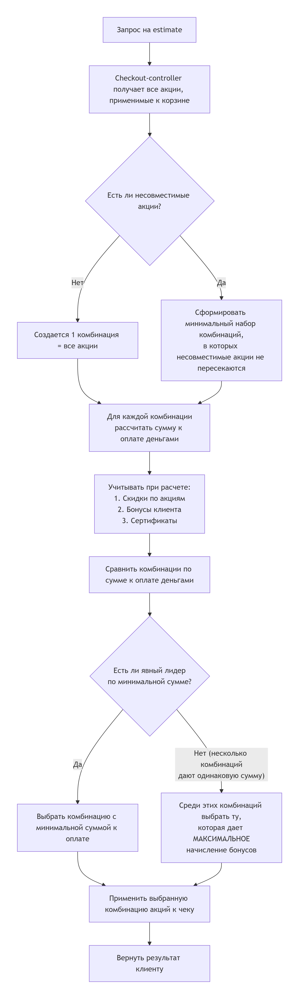

# Арбитраж акций

Не все доступные клиенту акции совместимы. Несовместимость с другими акциями настраивается при создании:

Если среди всех доступных акций имеются несовместимые, они разделяются на группы.

Арбитраж основывается на том, что система выбирает лучшую комбинацию акций для клиента, которая даёт минимальную сумму к оплате деньгами.

## Алгоритм создания комбинации акций

1. Система берёт все акции, применимые к корзине/чеку
2. Смотрит, какие акции помечены как несовместимые
3. Создаёт минимальный набор комбинаций (групп), в которых несовместимые акции не пересекаются

## Оценка комбинаций (метод Estimate)

Для каждой группы акций система считает финальную сумму к оплате клиента с учётом:

* Скидок по акциям
* Бонусов клиента
* Сертификатов

::: tip Важно

Порядок зафиксирован — сначала скидки, потом бонусы и сертификаты

:::

## Выбор победившей группы 

1. Сначала выбирается комбинация с наименьшей суммой к оплате живыми деньгами
2. Если суммы равны, выбирается группа, которая даёт максимальное начисление бонусов 

## Схема работы арбитража

1. Checkout-controller получает запрос (estimate)
2. Читает все акции и их несовместимости
3. Строит все возможные комбинации акций без конфликтов
4. Для каждой группы считает сумму к оплате деньгами (с учётом скидок, потом бонусов, потом сертификатов)
5. Выбирает комбинацию с минимальной суммой
6. Если суммы равны — выбирает комбинацию с максимальным начислением бонусов
7. Применяет выбранную комбинацию к чеку

## Пример работы арбитража акций

### Исходные данные

**Корзина клиента:** 5 000 ₽

**Доступные акции:**

| Акция | Условие    | Скидка              | Начисление бонусов | Несовместима с |
|-------|------------|---------------------|--------------------|----------------|
| A     | от 3 000 ₽ | 20% (1 000 ₽)       | 100                | B              |
| B     | от 2 000 ₽ | Фиксированная 300 ₽ | 200                | A, C           |
| C     | от 4 000 ₽ | 15% (750 ₽)         | 300                | B              |

**Бонусы клиента:** 500 бонусов (1 ₽ = 1 бонус)

---

### Сценарий 1: Клиент не хочет списывать бонусы

#### Допустимые комбинации

| Комбинация | Состав   |
|------------|----------|
| 1          | Только A |
| 2          | Только B |
| 3          | Только C |
| 4          | A + C    |

#### Расчёт суммы к оплате

| Комбинация | Скидка  | Бонусы к списанию | Сумма к оплате деньгами |
|------------|---------|-------------------|-------------------------|
| A          | 1 000 ₽ | 0 ₽               | 4 000 ₽                 |
| B          | 300 ₽   | 0 ₽               | 4 700 ₽                 |
| C          | 750 ₽   | 0 ₽               | 4 250 ₽                 |
| A + C      | 1 750 ₽ | 0 ₽               | 3 250 ₽                 |

#### Выбор победителя

| Комбинация | Сумма к оплате        |
|------------|-----------------------|
| A + C      | **3 250 ₽** ← минимум |
| A          | 4 000 ₽               |
| C          | 4 250 ₽               |
| B          | 4 700 ₽               |

**Победитель:** A + C

#### Результат

- Сумма к оплате деньгами: **3 250 ₽**
- Скидка: 1 750 ₽
- Списано бонусов: 0 ₽
- Начислено бонусов: 400

---

### Сценарий 2: Клиент ХОЧЕТ списать бонусы

#### Расчёт суммы к оплате

| Комбинация | Скидка  | Бонусы к списанию | Сумма к оплате деньгами |
|------------|---------|-------------------|-------------------------|
| A          | 1 000 ₽ | 500 ₽             | 3 500 ₽                 |
| B          | 300 ₽   | 500 ₽             | 4 200 ₽                 |
| C          | 750 ₽   | 500 ₽             | 3 750 ₽                 |
| A + C      | 1 750 ₽ | 500 ₽             | 2 750 ₽                 |

#### Выбор победителя

| Комбинация | Сумма к оплате        |
|------------|-----------------------|
| A + C      | **2 750 ₽** ← минимум |
| A          | 3 500 ₽               |
| C          | 3 750 ₽               |
| B          | 4 200 ₽               |

**Победитель:** A + C

#### Результат

- Сумма к оплате деньгами: **2 750 ₽**
- Скидка: 1 750 ₽
- Списано бонусов: 500 ₽
- Начислено бонусов: 400

---

### Сравнение сценариев

| Параметр                | Без списания бонусов | Со списанием бонусов |
|-------------------------|----------------------|----------------------|
| Выбранная комбинация    | A + C                | A + C                |
| Скидка                  | 1 750 ₽              | 1 750 ₽              |
| Списано бонусов         | 0 ₽                  | 500 ₽                |
| Сумма к оплате деньгами | 3 250 ₽              | 2 750 ₽              |
| Начислено бонусов       | 400                  | 400                  |
