---
meta:
- name: description
  content: Мониторинг подключения трекинга, почтовых доменов и блоков рекомендаций.
---

# Настройки магазина

## Статус подключения

В этом разделе осуществляется мониторинг интеграции интернет-магазина с {{ $var.companyName }}.

### События

Выводится список передаваемых событий и указывается интервал времени, когда в последний раз передавалось событие.

Если промежуток времени большой и время выводится красным шрифтом, то необходимо проверить интеграцию.

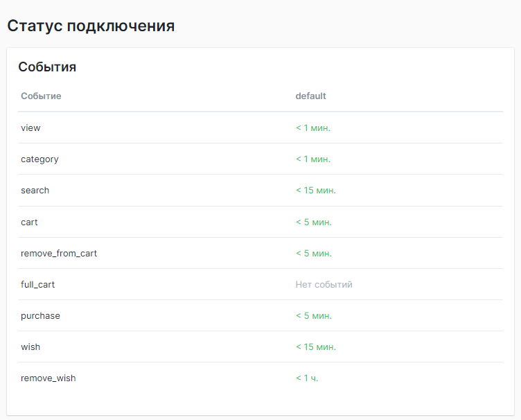

### Заказы

Выводится доля заказов, оформленная пользователями без указания email или телефона за последние 48 часов.

Для накопления клиентской базы и увеличения охвата триггерными цепочками, данный показатель нужно стремиться свести к нулю.

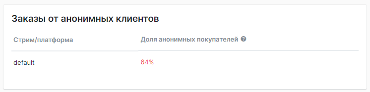

### Блоки рекомендаций

Выводится список установленных блоков рекомендаций и последние запросы к ним по времени.

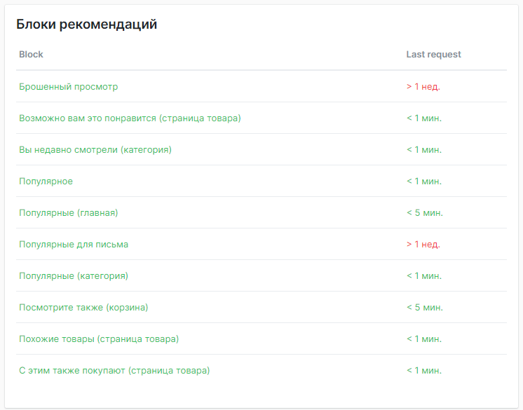

### Почтовые домены

Выводится список созданных почтовых доменов и статус настройки DNS записей.

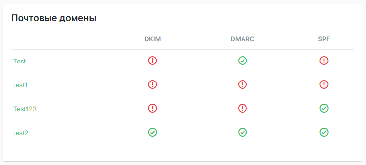

## Настройки магазина

| Название                                                   | Описание                                                                                                                                                                                                                             |
|------------------------------------------------------------|--------------------------------------------------------------------------------------------------------------------------------------------------------------------------------------------------------------------------------------|
| Код магазина                                               | Числовой код магазина                                                                                                                                                                                                                |
| Секретный ключ                                             | Числовой секретный ключ                                                                                                                                                                                                              |
| Название                                                   | Название магазина в системе {{ $var.companyName }}                                                                                                                                                                                   |
| URL магазина                                               | Веб-адрес магазина                                                                                                                                                                                                                   |
| Категория                                                  | Укажите, к какой категории относится ваш интернет-магазин                                                                                                                                                                            |
| CMS                                                        | Укажите, на какой CMS сделан ваш интернет-магазин                                                                                                                                                                                    |
| Валюта магазина                                            | Укажите валюту магазина                                                                                                                                                                                                              |
| Свой символ валюты в API ответах                           | При необходимости, укажите свой символ валюты                                                                                                                                                                                        |
| Формат цены в API ответах                                  | 1 000.50 или 1.000,50                                                                                                                                                                                                                |
| Временной интервал для расчета популярности товаров        | Указывается для работы алгоритма "Популярные" в блоках рекомендаций                                                                                                                                                                  |
| Период расчёта прибыли                                     | Указывается в месяцах. По умолчанию шесть. Период учитывается при расчёте прибыльности товаров. Расчёт осуществляется раз в сутки, в 4:30 по времени сервера, для оплаченных и активных магазинов, для товаров, у которых есть маржа |
| Учитывать прайс марджин для расчета рейтинга продаж        | Да/Нет                                                                                                                                                                                                                               |
| Ссылка на YML-файл                                         | Нужен для работы сервиса                                                                                                                                                                                                             |
| Период загрузки YML-файла                                  | Укажите период загрузки файла                                                                                                                                                                                                        |
| Правила подписки на рассылки                               | Укажите, как подписывать пользователей на рассылки                                                                                                                                                                                   |
| Передавать конверсию в Google Analytics Enhanced Ecommerce | Да/Нет                                                                                                                                                                                                                               |


## Логотип магазина

Рекомендуемые размеры:

Размер изображения: 256х256 px

Возможные форматы: JPEG, JPG, PNG

Максимальный размер: 1 Mb

Фон: прозрачный.

::: tip Обратите внимание
Логотип используется при отправке триггерных и массовых web push и mobile push рассылок.
:::

## Сотрудники

Если в интернет-магазине больше одного сотрудника и нужно ограничить права доступа, то это можно сделать в этом разделе.

Вы можете пригласить сотрудника из-под учетной записи администратора и после того, как он появится в системе, выставить ему необходимые права на инструменты.

Для этого нужно нажать на ФИО сотрудника и проставить доступы.

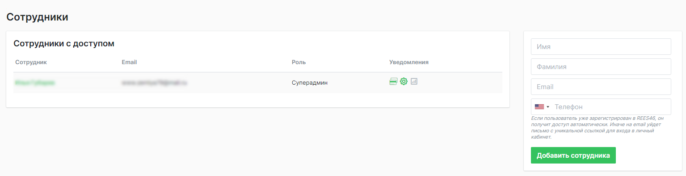

## Роли

При добавлении сотрудников, вы можете управлять ролями.

Например, добавить роль «email-маркетолог» и открыть только те разделы сервиса, которые нужны ему в работе.

Таким образом можно гибко настраивать уровни доступа разным сотрудникам в компании.

Роль присваивается при редактировании сотрудника, в разделе «Сотрудники».

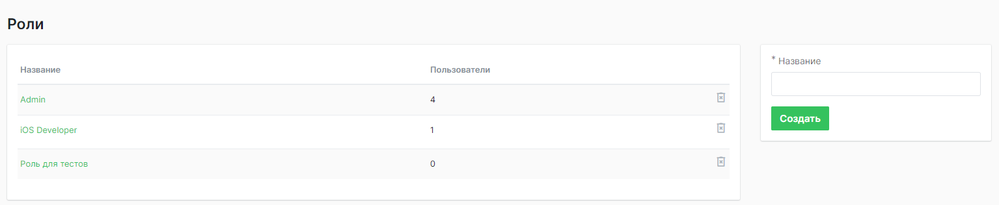

## Настройки email/пуш

### Общие настройки:

В этом разделе вы можете добавить домены, при отправке на которые, мы не будем устанавливать наши UTM.

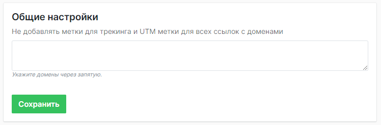

### Настройки email:

**Сообщение после отписки:**

Текст сообщения, которое увидит пользователь после отписки от рассылки.

**Адреса для получения копий массовых рассылок:**

Через запятую указываются адреса, куда будут уходить копии писем.

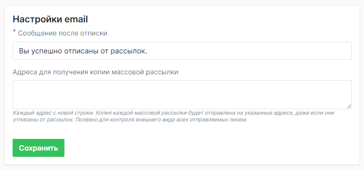

### Настройки Telegram:

Для работы рассылок в Telegram нужен готовый существующий бот, для связи {{ $var.companyName }} и мессенджера.

Рассылки отправляются в канал c ботом.

Для отправки сообщений, в разделе с контактными данными пользователей, необходимо выгрузить telegram id (в разделе [CDP/CRM](../cdp/index.md)).

Без данного токена не будет связи Telegram бота и {{ $var.companyName }}, а без данных telegram id мы не сможем отправлять сообщения пользователям.

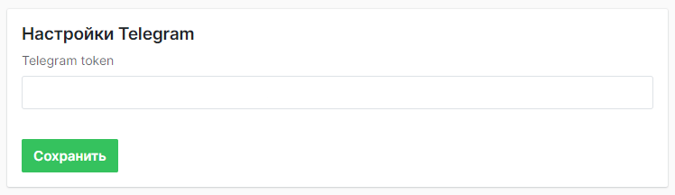

### Настройки web-push уведомлений:

Раздел для настройки пушей в браузере.

Здесь необходимо указать путь к  файлу service worker.

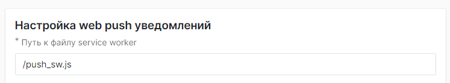

**Safari**

Загрузить сертификат и его пароль (пароль нужен только для пушей в Safari).

::: warning Обратите внимание
Для показа пушей на Safari – сертификат платный, без сертификата мы не сможем отправлять пуши в данный браузер.
:::

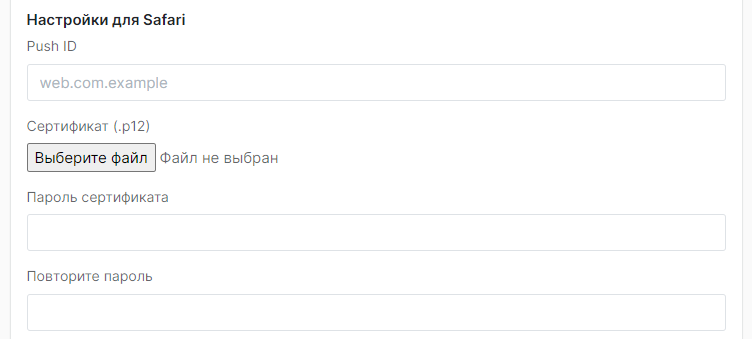

**Настройки Веб-пуш:**

1. При создании магазина, ключи для веб пушей генерируются автоматически и отображаются в этом разделе.

2. Также здесь можно настроить время жизни пуша, максимальное значение 672 часа.
   От времени жизни зависит, через какое время пользователю не будет доставлен и показан пуш.
   Если пользователь запустил браузер в течение жизни пуша, он ему будет доставлен и показан.

3. Плюс в этом разделе доступен для скачивания файл, который нужно установить на сайт, чтобы мы имели возможность забирать веб-пуш токены пользователей в систему.
   После того как вы установили файл на ваш сайт, необходимо обновить установку файла в этом же разделе настроек.

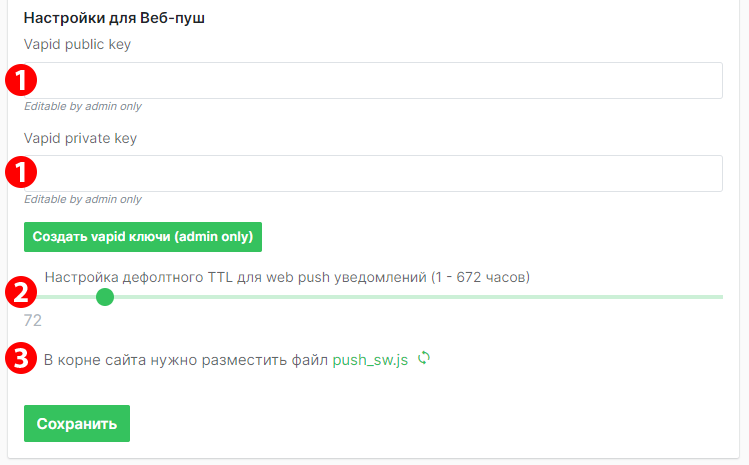

### Настройка mobile push уведомлений:

Включает в себя настройки для отображения пушей в мобильном приложении.

::: warning Обратите внимание
Сайт и мобильное приложение интегрируются отдельно. Чтобы отправлять мобильные пуши, необходимо полностью сделать интеграцию мобильного приложения с {{ $var.companyName }}, без полной интеграции пуши работать не будут.
:::

**Для работы пушей в приложении ios:**

Необходимо указать идентификатор приложения, приложить сертификаты (сервисный файл, для разрешения отображения пушей).

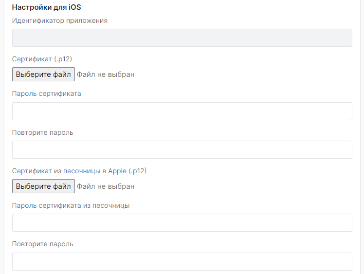

**Для работы пушей в приложении android:**

Для настройки отправки push-уведомлений на устройства Android необходимо загрузить файл `serviceAccountKey.json`.

(Ключ можно получить в консоли [Firebase](https://console.firebase.google.com/) на вкладке Service accounts)

Он необходим для авторизации от имени сервисного аккаунта, чтобы можно было:

- отправлять FCM-уведомления напрямую на устройства
- работать с другими сервисами Firebase

Также доступна кнопка добавления объекта «notification» при отправке сообщения.

При ее активации, уведомления будут сразу отображаться на устройстве. В уведомлении будет только заголовок и текст сообщения. Клик на уведомление будет вести на главный экран приложения, при этом трекинг работать не будет.

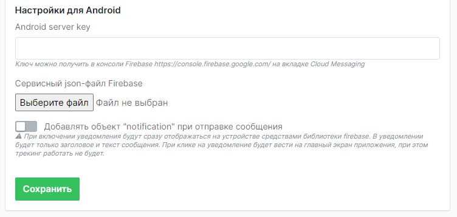

#### Сервисные json-файлы для Android

При настройке проекта в Firebase Console сервисные json файлы находятся во вкладках:

- General - в этой вкладке находятся общие настройки проекта, здесь  же подключается `google-services.json`
- Service accounts - вкладка для создания и управления ключами сервисных аккаунтов
- Cloud Messaging - здесь настраивается Firebase Cloud Messaging, включая управление серверными ключами

Каждая вкладка в консоли Firebase предоставляет доступ к определённому типу конфигурационных ключей, которые применяются в зависимости от вашей задачи (мобильная интеграция, серверная авторизация, Web Push).

Ключ `google-services.json` получается во вкладке General. Он нужен для того, чтобы приложение знало с каким Firebase-проектом оно связано и могло корректно использовать его возможности.

В частности, речь идёт об аутентификации, облачном хранилище, аналитики, FCM. Используется непосредственно в мобильном приложении.

`serviceAccountKey.json` - это ключ сервисного аккаунта Google Cloud, который используется на серверной стороне для безопасного взаимодействия с различными API Google от имени вашего проекта.

Файл содержит необходимые токены/ключи, чтобы пройти аутентификацию и авторизацию при взаимодействии с Google API.

Применительно к REES46, этот файл, загруженный через соответствующую форму, как указано выше, позволяет сервису получить **access token**, а затем обращаться к FCM API от имени вашего аккаунта.

Далее, когда сервис формирует push и отправляет его в FCM, в данных для авторизации отражается полученный ранее **access token**. В итоге FCM отправляет push пользователям.

::: tip vapidKey

Во вкладке Cloud Messaging можно получить `vapidKey`. Он нужен для авторизации сервера как отправителя уведомлений при настройке Web Push. Не используется для настройки мобильных пушей.

:::

## Настройки SMS

В этом разделе вы выбираете подключенного провайдера SMS.

Вы можете настроить несколько провайдеров в личном кабинете {{ $var.companyName }} и при отправке SMS выбирать их из списка.

Если вы хотите подключить нового провайдера SMS, то эта услуга оплачивается отдельно.

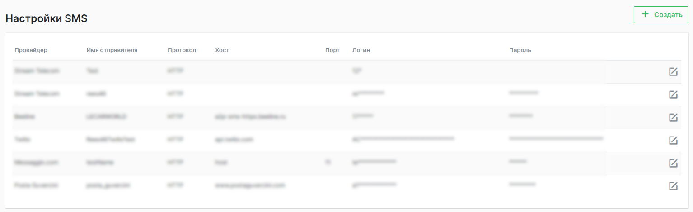

::: warning Обратите внимание
Перед тем, как подключить нужного провайдера к вам в кабинет, нужно совершить два шага:
1. Оплатить подписку SMS рассылок в {{ $var.companyName }}.
2. Зарегистрироваться в выбранном провайдере.
   :::

Настройки из кабинета провайдера, для возможности отправки сообщений, нужно будет указать после нажатия кнопки "Создать".

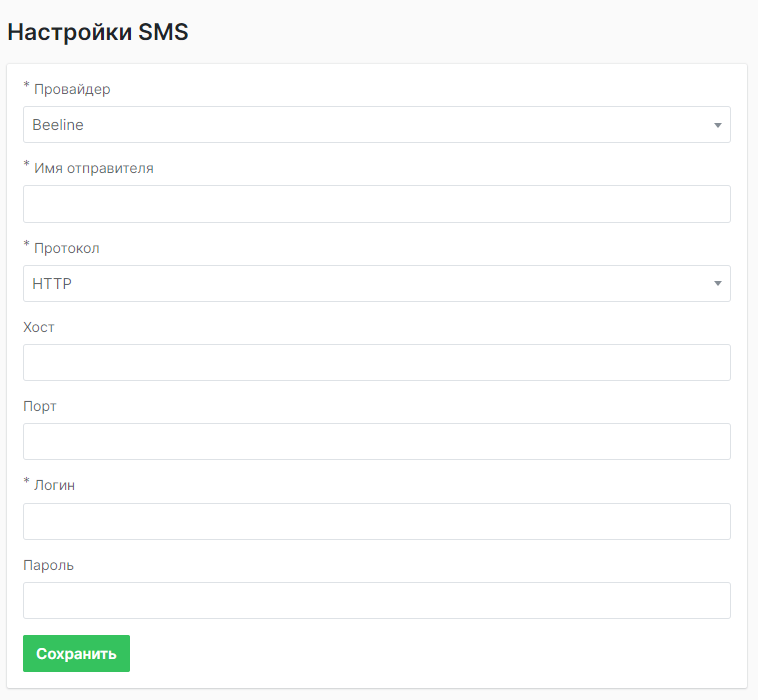

**Механика работы с SMS выглядит следующим образом:**

1. {{ $var.companyName }} отправляет провайдеру запрос, провайдер отправляет SMS пользователю.
2. Отслеживание статистики происходит после того, как клиент переходит по ссылке сообщения.
3. {{ $var.companyName }} не можем отследить получение и прочтение — только отправку, переход, покупку.

::: tip Важно
Пополнение баланса и оплата отправленных SMS происходит в личном кабинете провайдера.
:::

## Почтовые домены

В этом разделе хранится информация о подключенных почтовых доменах в системе.

На скриншоте ниже показано, как отслеживается корректность настройки [DNS записей](../messaging_configuration/emails.md), где зеленый цвет говорит о их работоспособности, а красный уведомляет о том, что с какой-то записью произошла проблема.

Если присутствует проблема у одной из записей, рассылки отправлять с этого домена не получится.

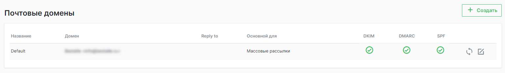

**При создании домена указываются следующие настройки:**

1. Название домена
2. Имя отправителя
3. Адрес отправителя
4. Почтовый адрес, на который будут приходить ответы с адреса отправителя (Reply to).
5. Для какого типа рассылки домен будет основным. Таким образом можно разделить домены для отправки триггерных и массовых рассылок.
6. Суточный лимит отправки писем для доменов (например на домен mail.ru с этого домена можно отправить 500 писем в сутки).

При обращении к службе поддержки или аккаунт-менеджеру, можно задать особые параметры доставки.

Доступ к этим настройкам есть только у пользователей с правами администратора.  JSON-объект с нужными параметрами.

Также при обращении к службе поддержки или аккаунт менеджеру, можно подключить опцию использования bounce-ящика на своём домене.

При использовании этой опции будет сгенерирован `Message-ID` с постфиксом в виде домена, а не сервера.

```
Message-ID: <message-id@ваш-домен.com>
```

::: warning Обратите внимание
Подключение опции  bounce-ящика изменяет структуру заголовка `Return-Path`.

Изначально структура выглядит следующим образом:

`bounce+ТИП_ПИСЬМА=КОД_ПИСЬМА@bounce.rees46.ru`

После переключения флага:

`bounce+ТИП_ПИСЬМА=КОД_ПИСЬМА@bounce.КАСТОМНЫЙ_ДОМЕН`

`КАСТОМНЫЙ_ДОМЕН` получается из поля "Адрес отправителя".
:::

Допускается использование кастомных доменов вместо доменов текущего кластера. Они будут применяться во всех публичных ссылках и материалах.

Запросить подключение можно через службу поддержки или у аккаунт-менеджера.

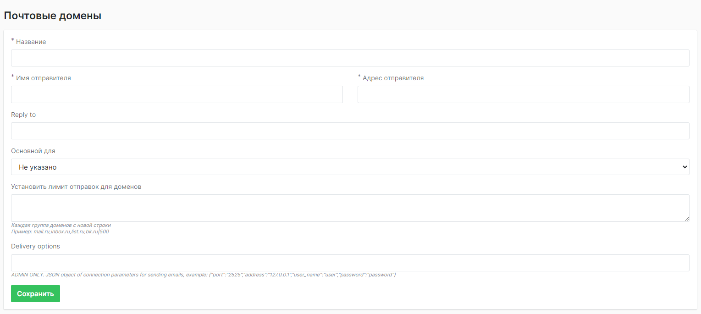

## Категории рассылок

Этот раздел позволяет присвоить категорию рассылкам.

При создании нового письма в [массовых рассылках](../bulk_emails/index.md), вы можете присваивать письму категорию.

Для того, чтобы список категорий отображался, необходимо сначала завести категории в этом разделе.

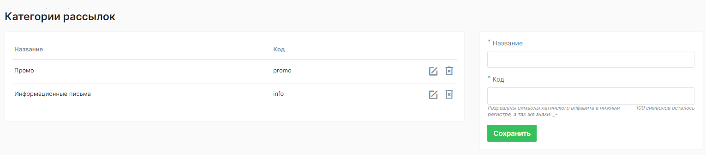

Это могут быть:

Промо письма, информационные письма, распродажи.

Наименование должно включать в себя имя в системе и код имени на латинском алфавите.

Создав категории писем, в дальнейшем вы сможете отслеживать статистику по категориям.

## Пользовательские события

Этот раздел позволяет добавлять события, которые в дальнейшем можно использовать для работы триггерных цепочек.

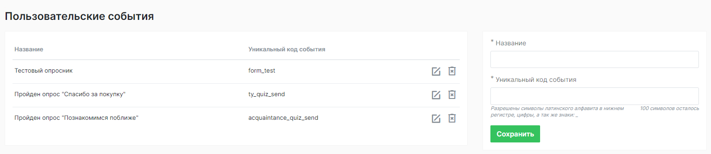

::: warning Обратите внимание
Пользовательские события можно передавать при условии существующей подписки на CDP.
:::

Раздел используется в том случае, если вам не хватает системных событий по умолчанию.

**Примеры пользовательских событий:**

1. Если пользователь нажал на кнопку, при передаче такого события с сайта, мы сможем запустить цепочку.
1. Также это может быть событие заполнения какой-либо статичной формы на стороне вашего сайта.

В разделе нужно создать наименования события и прописать его уникальный код.

Метод передачи событий для [SDK](https://reference.api.rees46.com/?javascript#track-custom-event/)

Метод передачи событий для [Backend](https://reference.api.rees46.com/?shell#track-custom-event)


## Статусы заказов

По умолчанию, в системе доступны три статуса заказа:
1. Оформлен
2. Выполнен
3. Отменен.

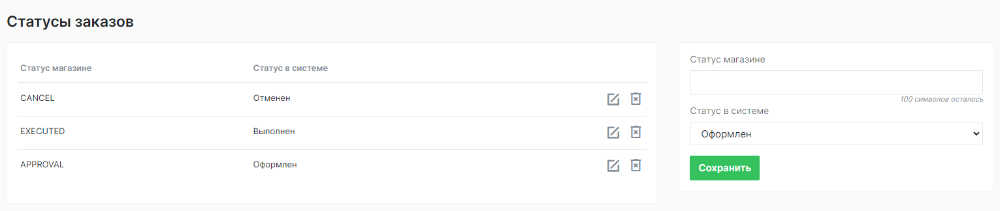

Данный раздел позволяет настроить синхронизацию статусов магазина и присвоить все существующие статусы трем системным.

Для этого необходимо определить какой статус магазина будет соответствовать статусу системы.

Передать можно все статусы сразу, настроить соотношение в этом разделе. Передача осуществляется со стороны CMS.

Например: Оформлен = Передан на сборку

Метод передачи [статусов заказа](../../setup/integration/orders.md#синхронизация-статусов-заказов)

**Передача статусов заказов в {{ $var.companyName }} решает следующие задачи:**

1. Обеспечивает корректную работу триггерных  цепочек, чтобы отправлять триггер соотносительно статусу заказа.
1. Предоставляет актуальную статистику по заказам.

## Свойства профиля

В этом разделе создаются кастомные пользовательские свойства, т.е. свойства, которых нет в стандартном перечне системы.

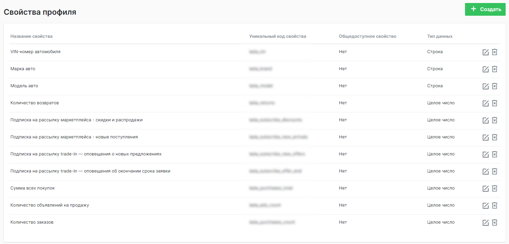

::: warning Обратите внимание
Передача свойств профиля, возможна только с подпиской на CDP.
:::

Кастомные свойства можно передавать и хранить в пользовательском профиле.

Это может быть такое свойство, как: день рождения, количество детей, настроение пользователя. В общем, что угодно, что вы хотели бы видеть в карточке клиента, чтобы иметь возможность выделять их в сегментах по этому признаку.

Из сущностей необходимо заполнить название, создать уникальный код свойства, передать его со стороны сайта, выбрать тип данных, который будет иметь это свойство.

Это может быть строка или число.

Например, при заполнении количества детей, в свойстве, как тип данных, нужно указать число.

А также задать свойству вариант общедоступности.

Если свойство общедоступное, вы сможете его передать через метод [Read profile info](https://reference.api.rees46.com/?javascript#read-profile-info)

Благодаря этому методу, вы можете передать свойства в систему

Свойства профиля подробно описаны в разделе ["CDP"](../cdp/properties.md)

## Теги пользователей

Раздел для создания персонализированных тегов пользователей.

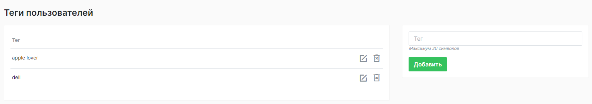

::: warning Обратите внимание
Возможность создания тегов доступна только с подпиской на CDP.
:::

Теги присваиваются в карточке пользователя, но для присвоения тега в карточке, его нужно создать в этом разделе.

Тег дает определенную характеристику клиенту, например в тегах можно указать имеющееся мобильное устройство, с которого заходит обычно пользователь, или указать его лояльность к бренду.

Теги пользователей подробно описаны в разделе ["CDP"](../cdp/tags.md)

## База данных

В этом разделе вы можете посмотреть логи сообщений по коду триггерного, массового или транзакционного сообщения.

Само письмо и его код можно найти в [карточке клиента](../cdp/client.md#история-рассылок), во вкладке "Сообщения".

На скриншоте код письма находится под названием кампании.

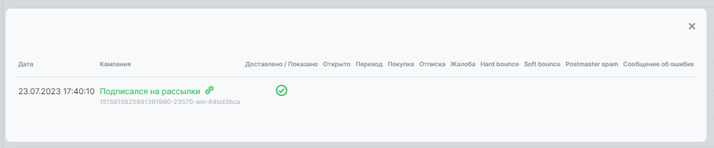

Благодаря этому методу, можно посмотреть лог отправки письма, время, дату и данные - например, профиль клиента и значение массива source_items в момент отправки письма.

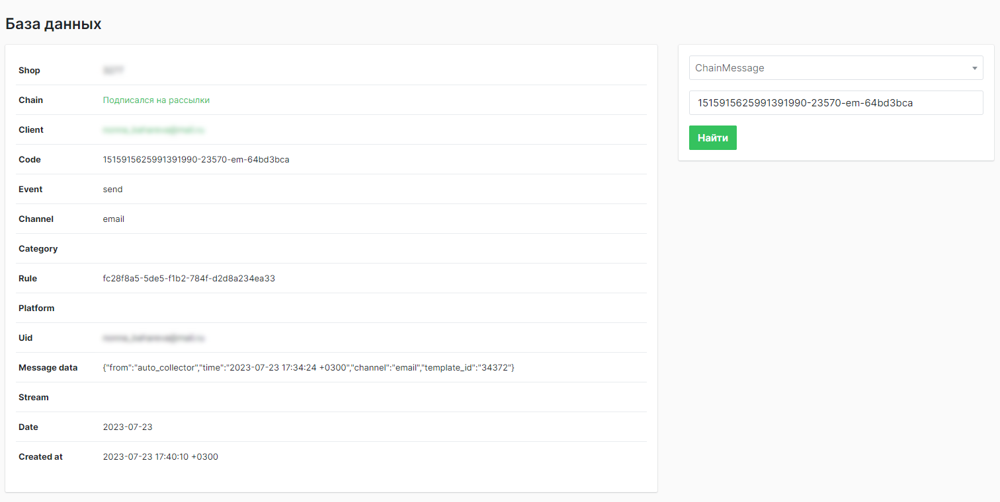

## Ловушка для запросов

В этот раздел попадают тестовые запросы отправки мобильных и веб-пушей.

Раздел нужен, чтобы видеть исходные данные и логировать запрос, для анализа и удобства тестирования.

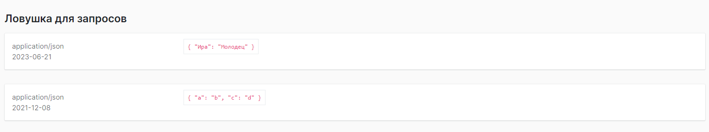

## События системы

Раздел для отслеживания событий в системе, где можно выбрать род события, источник события, состояние, определить промежуток времени происходящего события.

Сюда попадают события, такие как - загрузка пользователя, обновление товарного фида, изменения в работе цепочек или блоков и другие события, которые могут происходить в системе.

Например, вам необходимо посмотреть последние изменения в триггерных цепочках, для этого нужно выбрать:

1. Событие (update)
2. Продукт, по которому вы хотите отследить изменения ( в данном случае это chain-цепочки)
3. Состояние (необязательный пункт, но позволяет фильтровать тип данных, например отследить ошибки или посмотреть информацию).
4. Дату можно выбрать в правом верхнем углу и за этот период вы увидите данные по изменениям цепочек, с информацией - кто, когда и какую цепочку менял.

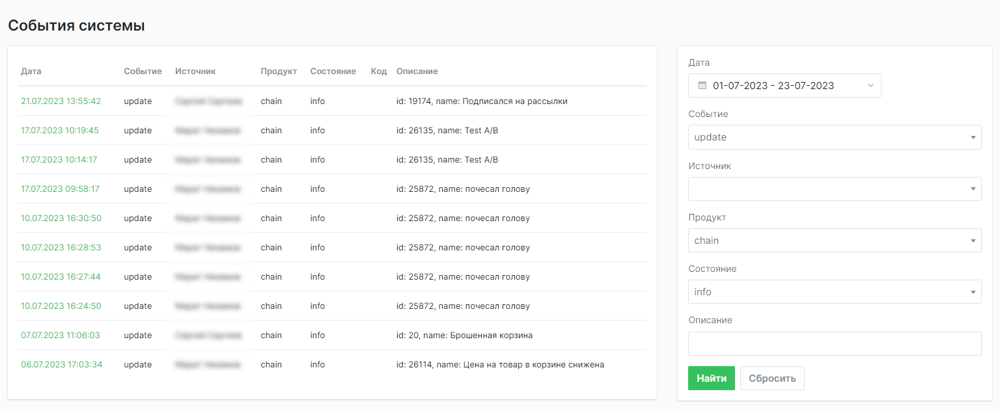


## Настройки аккаунта

В этом разделе фиксируются ваши личные данные, логин/пароль, также есть возможность изменить пароль.

Тут же вы можете внести информацию о себе, должность, компания, номер телефона, часовой пояс.

Также здесь хранятся ключи, необходимые при сбоях, приватный и публичный.

Каждый пользователь в этом разделе видит свои данные, даже если находится в общем личном кабинете.


## Кастомные домены

Чтобы начать использовать кастомные домены, сообщите их названия. Сделать это можно через службу поддержки или аккаунт-менеджеров.

После получения доменов мы добавим их в конфигурацию NGINX.

Когда всё настроено для получения запросов с указанных доменов, клиент получит разъяснение: что нужно прописать в DNS.

Настройка CNAME-записей в DNS клиента позволяет направлять трафик с кастомных доменов на нашу инфраструктуру. Фактически, маршрутизация через DNS превращает кастомный домен в "псевдоним" нашего сервиса.

После создания записи уведомите техническую поддержку или аккаунт-менеджера. Сообщите, что запись создана. Специалисты REES46 её проверят и убедятся, что всё работает корректно.

Следующий шаг - попросить службу поддержки прописать кастомные домены в административной панели магазина.

После этого нужно поменять адрес CDN в скрипте на сайте, а также прописать кастомные домены при [инициализации SDK](https://reference.api.rees46.com/?javascript#setup).

### Процесс настройки кастомного домена поэтапно

1. Сообщить названия доменов
2. Получить инструкции по настройке CNAME-записи в DNS
3. Сообщите нам, когда запись будет готова — мы всё проверим
4. Обратиться к службе поддержки, чтобы они прописали кастомные домены в административной панели магазина
5. Поменять адрес CDN в скрипте на сайте
6. Прописать кастомные домены при инициализации SDK