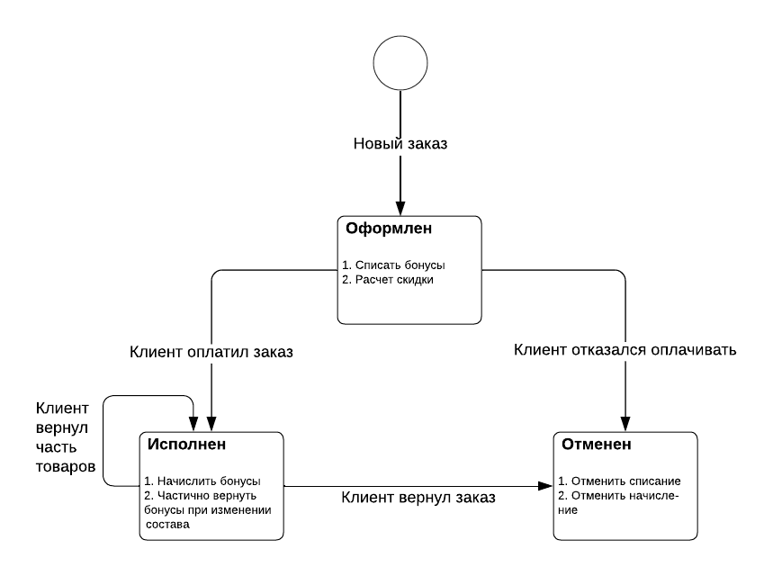
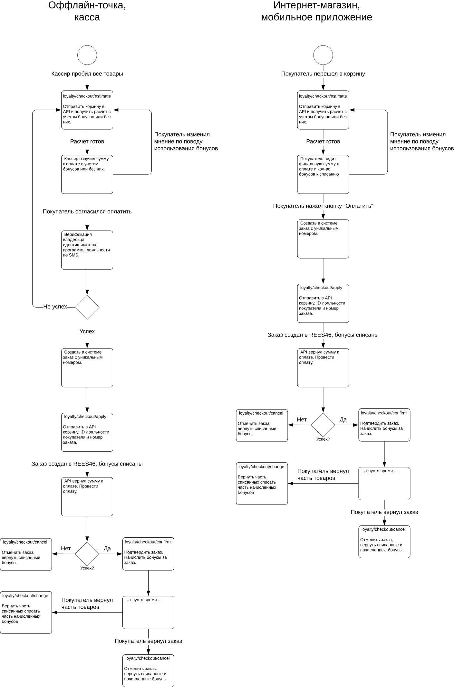

# Процессинг и обработка заказов

Данная группа методов API является основной программы лояльности. Методы принимают на вход информацию о покупателей, текущую корзину (или набор услуг), выполняют расчет скидок, вознаграждений покупателя и реферальных партнеров, сертификаты, подписки, промокоды и пр.

## Жизненный цикл заказа

| Метод                                  | Описание                                                                                 |
|----------------------------------------|------------------------------------------------------------------------------------------|
| [`checkout/estimate`](./estimate.md)   | Предварительная оценка скидок и вознаграждений без блокировки бонусов для списания       |
| [`checkout/apply`](./apply.md)         | Зарезервировать бонусы, сертификаты и промокоды, привязать сохранить информацию о заказе |
| [`checkout/confirm`](./confirm.md)     | Подтвердить заказ после оплаты (в рознице) или доставки (онлайн)                         |
| [`checkout/cancel`](./cancel.md)       | Полностью отменить заказ (полный возврат или отмена)                                     |
| [`checkout/change`](./change.md)       | Внесение изменений в подтвержденный заказ (для частичного возврата)                      |

Помимо этого есть ряд вспомогательных методов для работы с заказом:

| Метод                              | Описание                                                      |
|------------------------------------|---------------------------------------------------------------|
| [`checkout/details`](./details.md) | Подробная информация о заказе программы лояльности            |
| [`checkout/history`](./history.md) | История всех заказов программы лояльности конкретного клиента |

## Схема интеграции

Общая схема для интеграции на кассе и для сайта выглядит почти одинаково. С разницей, что на кассе может потребоваться подтверждение владельца идентификатора программы лояльности по СМС (опционально).

