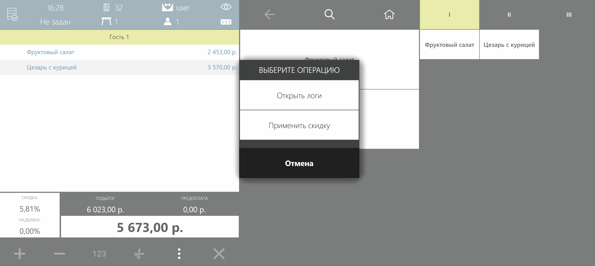
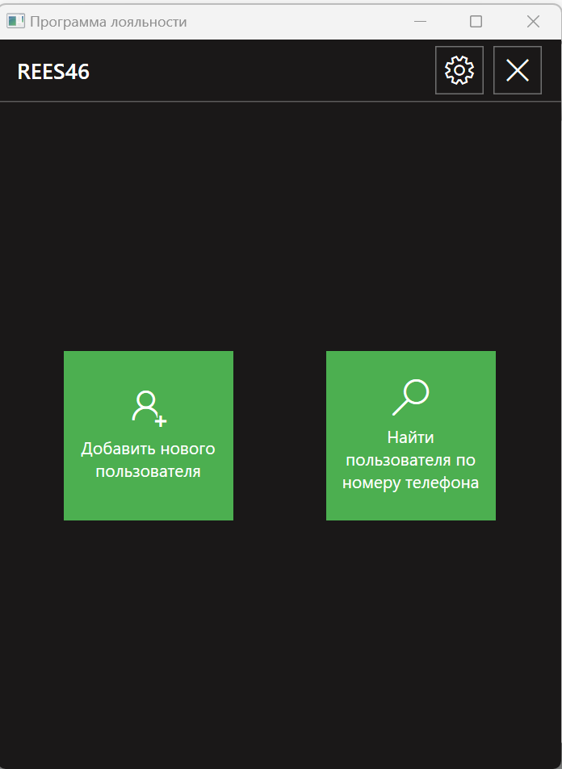
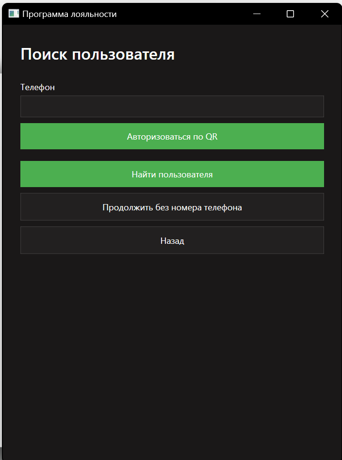
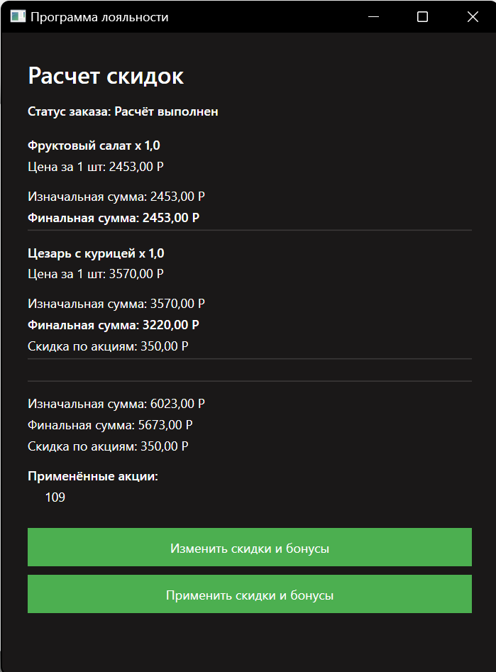
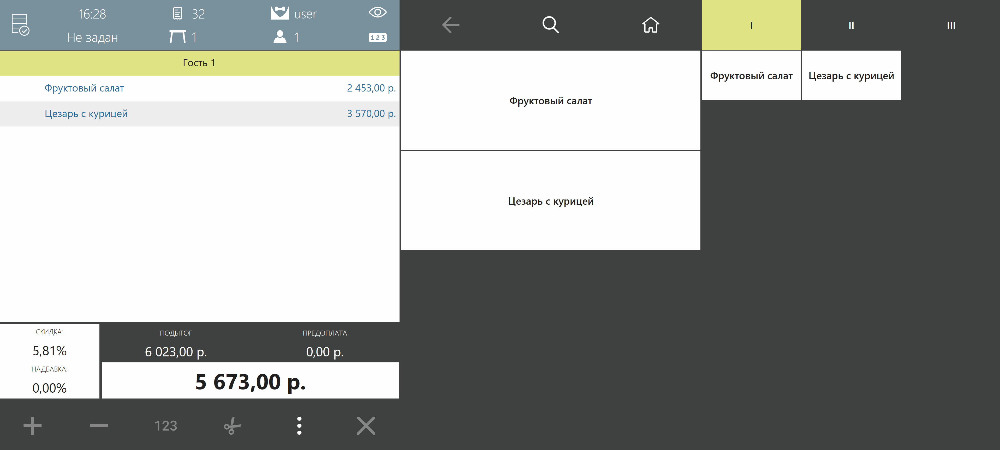

# Интеграция программы лояльности с IIKO

Для начала интеграции программы лояльности REES46, нужно получить папку с файлами плагина от службы поддержки. 

Кассовое оборудование имеет стандартную файловую систему Windows. Чтобы установить плагин программы лояльности, достаточно будет переместить полученную папку(Rees46.LoyaltyProgram) по указанному пути:

:::info Полный путь до папки назначения

C:\Program Files\iiko\iikoRMS\Front.Net\Plugins

:::

:::warning  Важно

В процессе добавления папки, программа iikoFront должна быть выключена

:::

После перемещения плагина в папку назначения, достаточно будет запустить _iikoFront_ и программа лояльности уже будет установлена на терминале. 

## Первичная настройка модуля программы лояльности

Программа лояльности будет доступна через кассовый интерфейс. Нужно последовательно нажать кнопки: **Дополнительно** и **Применить скидку**.

Пользователь попадёт в интерфейс плагина, где нужно будет осуществить первичную настройку.

В появившемся окне нужно ввести `shop_id` и `shop_secret`. Теперь REES46 будет знать для какого магазина нужно производить расчёты. 

## Процесс работы с плагином лояльности

Первичная настройка завершена. Теперь рассмотрим как плагин будет работать при взаимодействии с покупателями. 

Сценарий взаимодействия будет выглядеть так:

1. Создание заказа и добавление позиций в системе IIKO
2. Кассир переходит к этапу использования инструментов программы лояльности. Для этого нужно нажать на кнопку **Применить скидку**
3. Следующий этап - идентификация покупателя в системе программы лояльности REES46. Идентификация может происходить по номеру телефона или по QR через Wallet покупателя

  

    
  

  

    
  

4. После авторизации, на стороне REES46 происходит расчёт скидок, применение бонусов и иных инструментов программы лояльности для конкретного покупателя

5. Скидки и бонусы применяются к чеку

## Работа с обновлениями плагина программы лояльности

На момент написания этой инструкции, автоматическое обновление плагина не предусмотрено.

При необходимости обновить его, потребуется повторно обратиться в службу поддержки и получить новую папку с обновлённым плагином программы лояльности. 

Затем нужно будет снова интегрировать его с кассой как описано в данной инструкции.