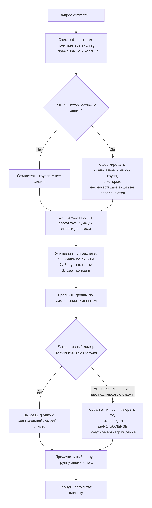

# Арбитраж акций

Не все доступные клиенту акции совместимы. Несовместимость с другими акциями настраивается при создании:

Если среди всех доступных акций имеются несовместимые, они разделяются на пулы.

Арбитраж основывается на том, что система выбирает лучшую комбинацию акций для клиента, которая даёт минимальную сумму к оплате деньгами.

## Алгоритм создания пула

1. Система берёт все акции, применимые к корзине/чеку
2. Смотрит, какие акции помечены как несовместимые
3. Создаёт минимальный набор комбинаций (групп), в которых несовместимые акции не пересекаются

## Оценка пулов (метод Estimate)

Для каждой группы акций система считает финальную сумму к оплате клиента с учётом:

* Скидок по акциям
* Бонусов клиента
* Сертификатов

::: tip Важно

Порядок зафиксирован — сначала скидки, потом бонусы и сертификаты

:::

## Выбор победившей группы 

1. Сначала выбирается группа с наименьшей суммой к оплате живыми деньгами
2. Если суммы равны, выбирается группа, которая даёт максимальное бонусное вознаграждение 

## Схема работы арбитража

1. Checkout-controller получает запрос (estimate)
2. Читает все акции и их несовместимости
3. Строит все возможные группы акций без конфликтов
4. Для каждой группы считает сумму к оплате деньгами (с учётом скидок, потом бонусов, потом сертификатов)
5. Выбирает группу с минимальной суммой
6. Если суммы равны — выбирает группу с максимальным начислением бонусов
7. Применяет выбранную группу к чеку

